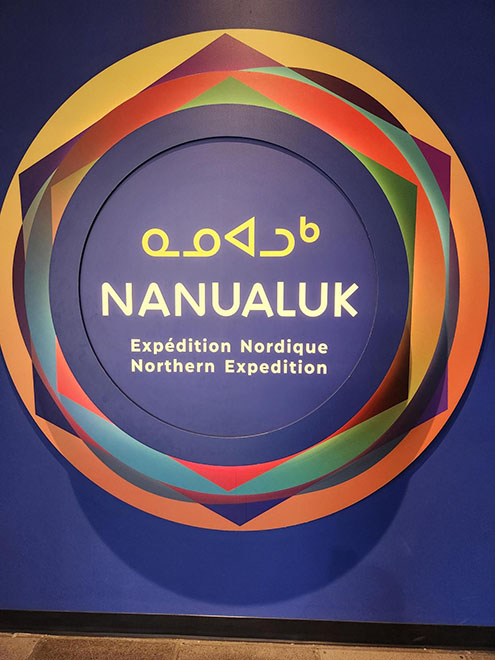
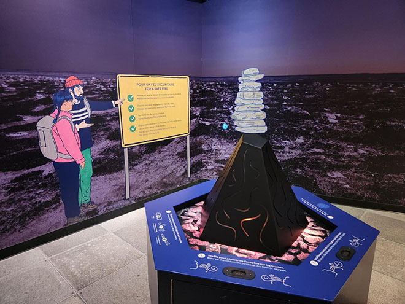
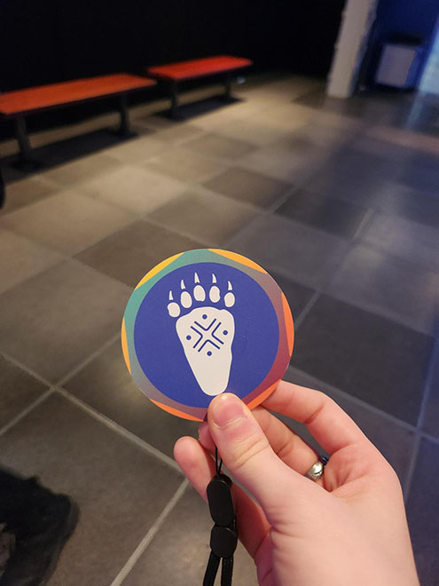
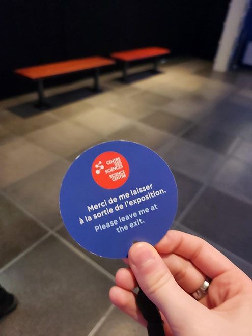
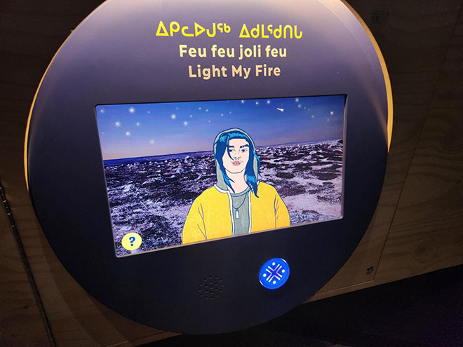
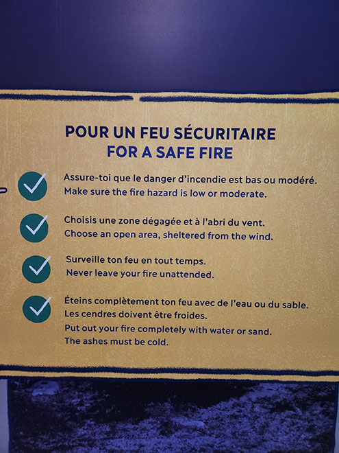
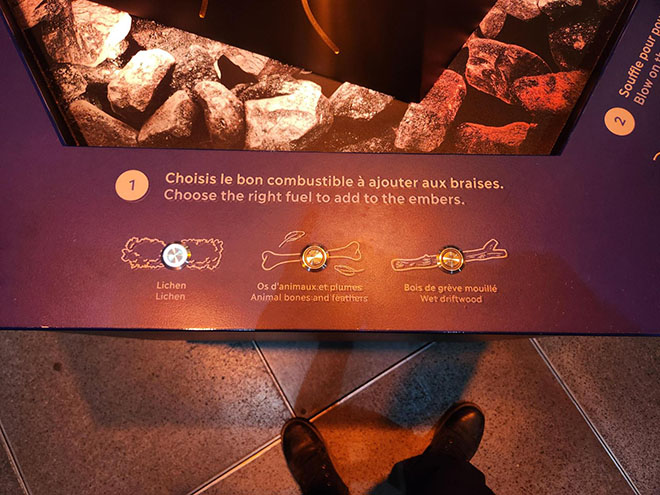
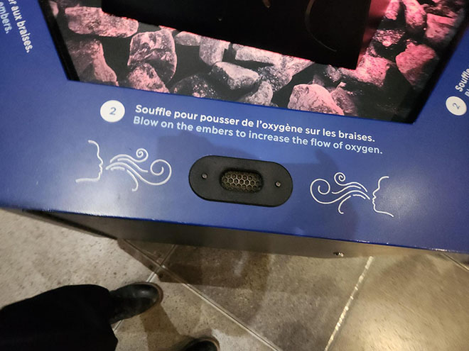
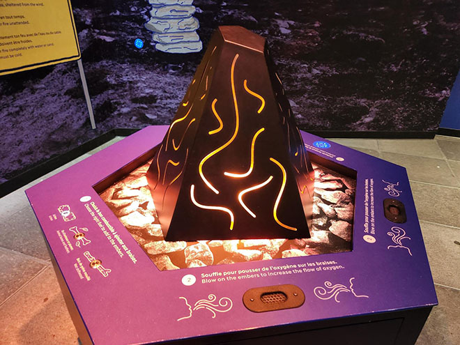
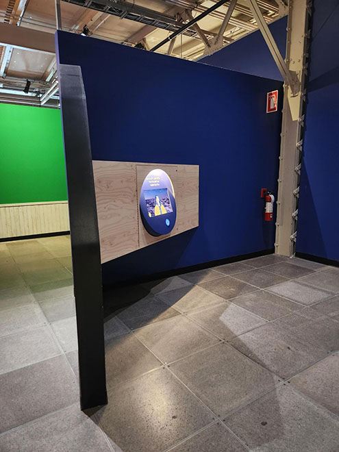

# Nanualuk — Expédition nordique

## Présentation générale de l'exposition

> Affiche de l'exposition

Nanualuk — Expédition nordique est une exposition permanente interactive à but éducatif, destinée principalement aux enfants mais accessible et appréciable par tous les publics. L'exposition est présentée au Centre des Sciences de Montréal depuis le 1er mars 2026.

> Anne-Julie Labrie, moi et Thomas Bozelko devant l'affiche lors de notre visite le 1er avril 2026.

## Feu feu joli feu : le dispositif en détail

> Vue d'ensemble de la structure intéractive

### Description

Ce dispositif est présenté comme un apprantissage intéractif pour apprendre à allumer un feu de camp dans la nature, au travers d'instruction, de boutons et de gestes à exécuter par le spectateur ou la spectatrice.

### Composantes et parcours spectateur

De nombreuses composantes sont utilisées dans ce dispositif. Avant de rentrer dans l'exposition, le spectateur ou la spectatrice doit prendre un badge qui lui permet d'activer les différents dispositifs.

> Badge d'activation

Tout d'abord, le spectateur ou la spectatrice active le dispositif à l'aide d'un capteur placé sous l'écran de présentation. Une animation se lance alors sur l'écran pour présenter l'activité.

> Écran de présentation

Ensuite, le spectateur ou la spectatrice est guidé·e vers le dispositif en forme de feu, au centre du dispositif complet. Des instructions sont affichées sur l'un des murs et sur le cadre entourant le feu. Des boutons et divers éléments interactifs sont présenté autour du feu et permettent de prendre part à l'activité.

> Les instructions et éléments interactifs.

Si le spectateur ou la spectatrice parvient à utiliser tout les éléements correctement, alors le feu s'allume !

> Le feu allumé

### Disposition, mise en espace et éléments nécessaires à l'exposition

Le dispositif est entouré de trois mur et placé dans l'un des coins de la salle.

> Lieu de mise en exposition.

La plupart des éléments nécessaires à l'expositions sont cachésdans des blocs en bois d'où ne sortent aue les écrans de présentation.

### Expérience vécue & avis

J'ai beaucoup aimé l'exposition dans son ensemble, l'interactivité et l'immersion fonctionne bien et on se prend rapidement au jeu.

### Références

Photos : Théana Leurot

Sites web consultés : 

- [Site officiel du Centre des Sciences](https://www.centredessciencesdemontreal.com/exposition-permanente/nanualuk-expedition-nordique)
