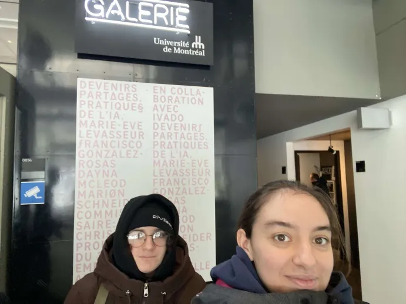
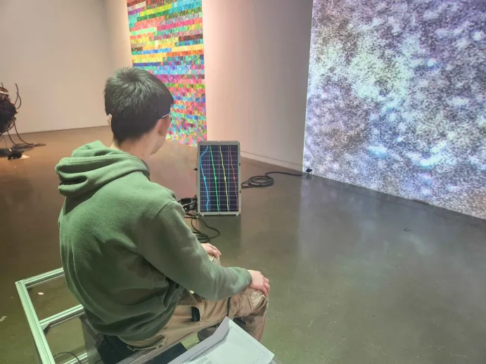
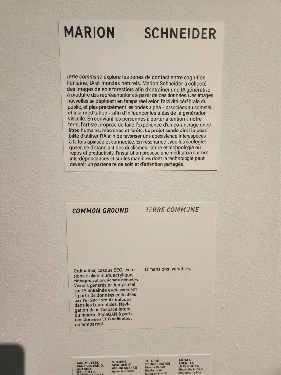
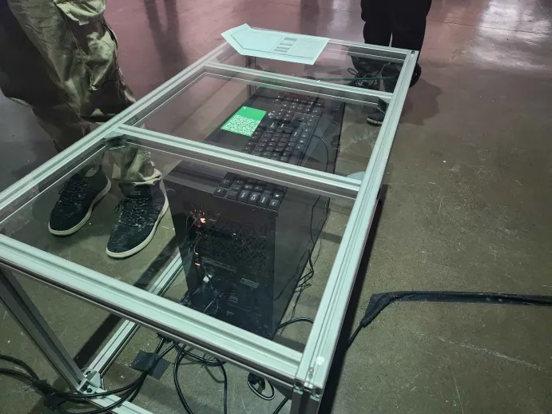
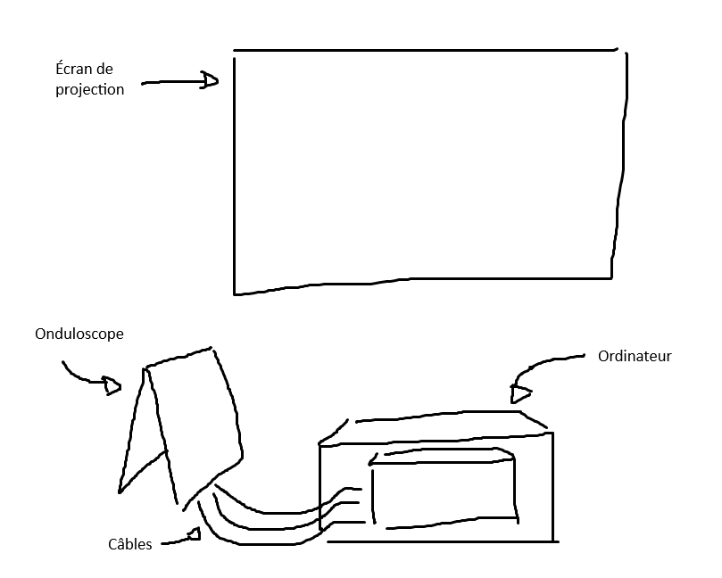

# DEVENIRS PARTAGÉS – PRATIQUES DE L'IA

## Expostion temporaire – Galerie UdeM

>Moi et Anne-Julie devant l'affiche, (30.01.2026). Photo prise par Anne-Julie.

## Terre Commune – Mario Schneider (2025)

>Vue d'ensemble du dispositif

### Description de l'oeuvre :

Cette oeuvre, à but interactif, est est composée d'un ordinateur protégé par une boite en verre, où le spectateur ets invité à s'assoir et à équiper un bandeau. Le-dit bandeau est un capteur à ondes, qui reçoit les ondes transmises par notre cerveau pour les envoyer dans l'ordinateur.

>L'ordinateur qui permet de présenter l'oeuvre

L'ordinateur est programmé pour calculer l'activité cérébrale du spectateur ou de la spectatrice via les ondes reçues, et à l'aide d'une intelligence artificielle entrainée préalablement par l'artiste, cette activité est transformée en images projetées en temps réel sur le mur en face du spectateur.

>Croquis de la mise en place du dispositif

### Ce qui m'a plu

Ce dispositif était présenté comme supposément relaxant. Le jour de la visite, je n'étais pas dans le meilleur des états, et je ne pensais pas que j'arriverais à me détendre. Cependant, me concetrer sur l'onduloscope et les images qui défilent m'a un peu aidée à me sentir mieux, même temporairement.

Cependant je n'ai vraiment pas eu l'impression que les images changeait en temps réel, même en observant d'autres personnes essayer. J'avoue avoir été un peu déçue.
