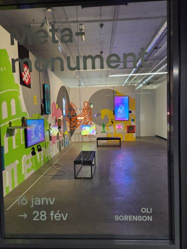
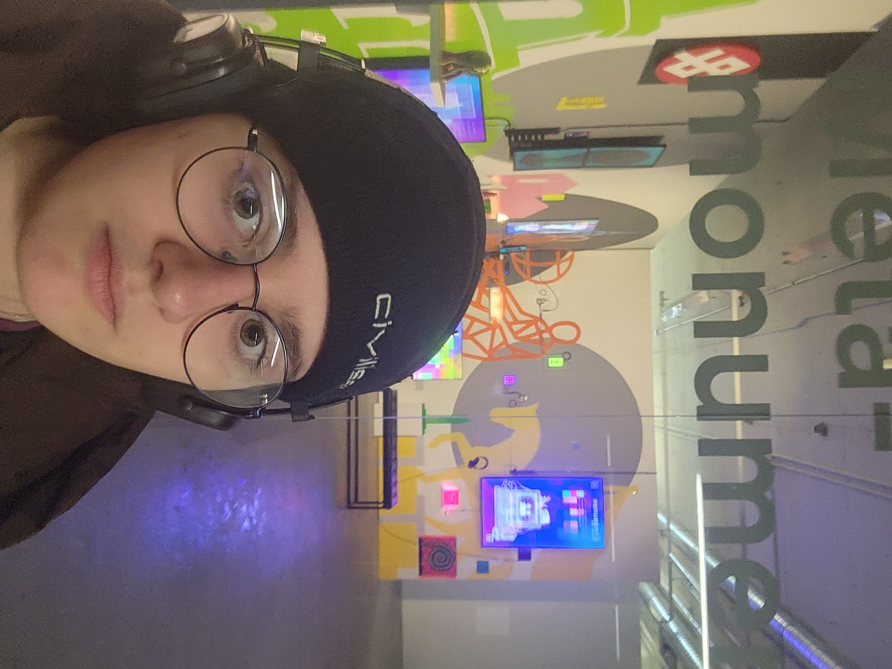
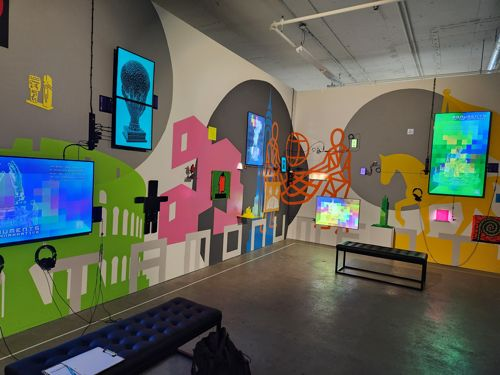
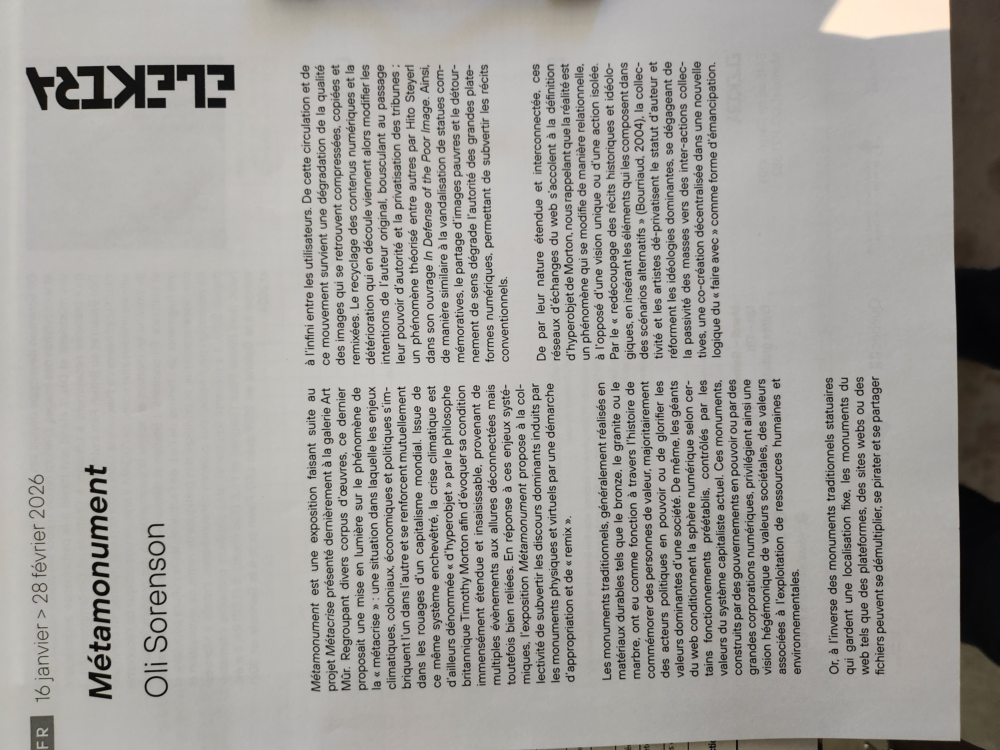
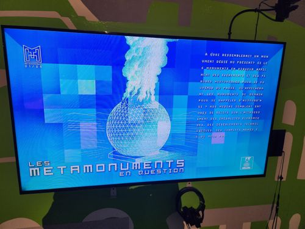
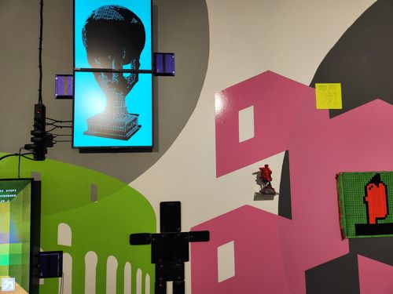
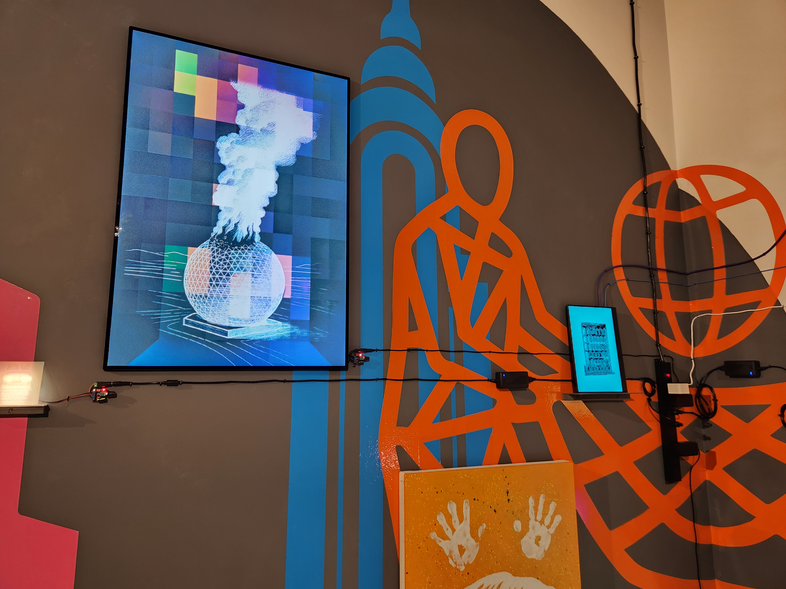
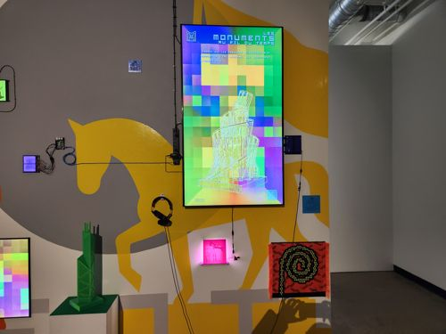
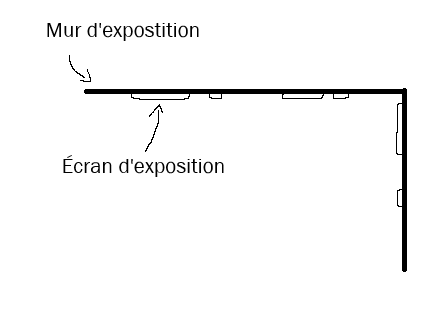

# MÉTAMONUMENT – Galerie ELEKTRA

## Présentation générale de l'expostition

> Affiche de l'exposition

Métamonument est une expostion temporaire contemplative présentée par Oli Sorenson et affichée à la Galerie ELEKTRA, dans la période du 16 janvier 2026 au 28 février 2026.

> Moi devant l'exposition lors de ma visite, le 27 février 2026

## Métamonument : l'oeuvre en détail

> Vue d'ensemble de l'oeuvre

### Description de l'oeuvre

> Cartel présentant l'oeuvre

L'exposition se présente par divers objets exposés contre deux murs, et parmi ces objets des écrans de différentes taillesqui diffusent des vidéos interconnectées. Ces vidéos présentent divers monuments, leurs origines et le contexte de crise dasn lequel ils sont plongés. Des versions miniatures issues d'impression 3D des monuments sont sont également exposées autour des écrans.

### Composantes, dispositions et parcours spectateur

> Mur plus long, perpendiculaire à l'entrée

L'oeuvre est composée de sept écran disposés sur deux murs perpendiculaires (nécessaires au dispositif d'exposition), entourés par des miniatures et des tappiseries murales représentant ces monuments

> Mur plus court, parallèle à l'entrée

L'oeuvre ne suit pas un parcours particulier, les deux plus gros écrans diffusent la même vidéo dans un intervalle de temps différent, ce qui permet à plusieurs personnes de suivre l'exposition en même temps. Le spectateur observe les différentes composantes de l'oevre et établi au fur et à mesure des liens entre elles.

> Croquis

### Mon avis

J'ai trouvé intéressante l'idée de connecter chaque élément entre eux et que le spectateur découvre et comprend à chaque nouvel élément. L'estétisme visuel est plutôt plaisant, je suis assez sensible aux couleurs vibrantes et aux murs remplis de détails reflétés dans l'exposition. Le message de l'oeuvre reste cependant quelque peu compliquer à cerner.

### Références

Photos et croquis réalisés par Théana Leurot

Site consulté : 
