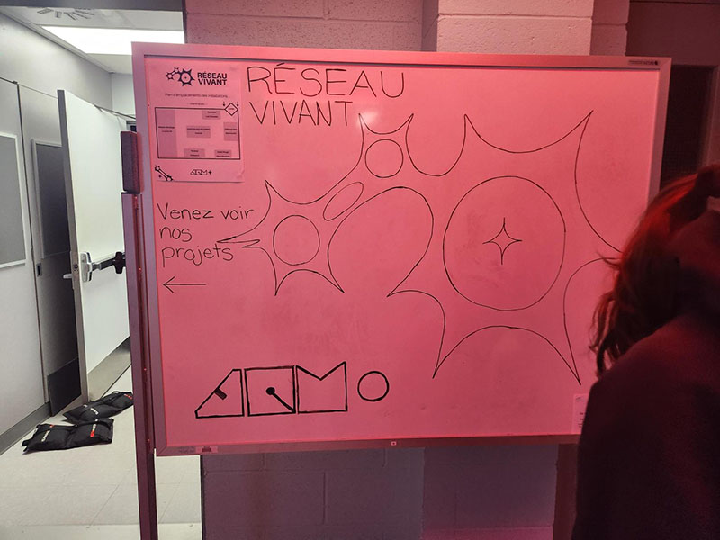
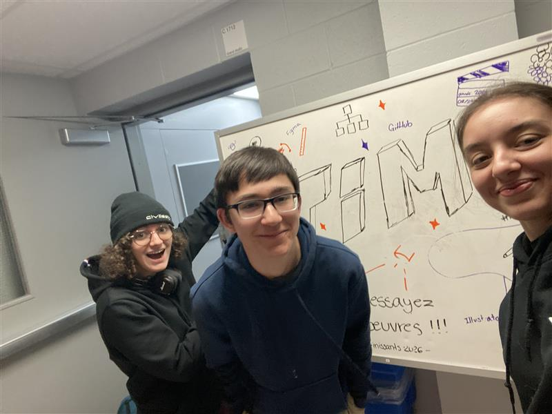
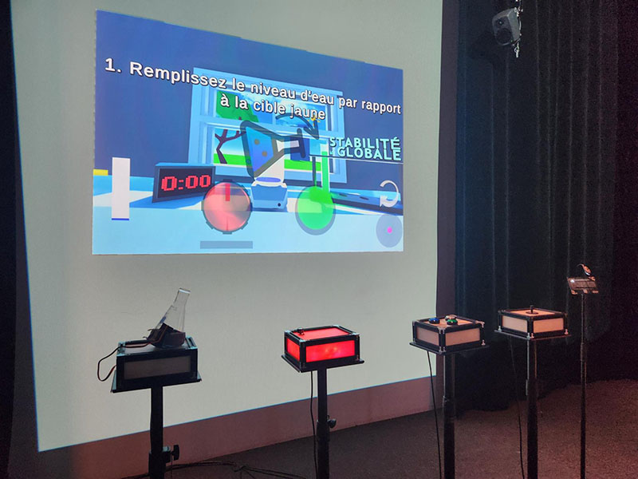
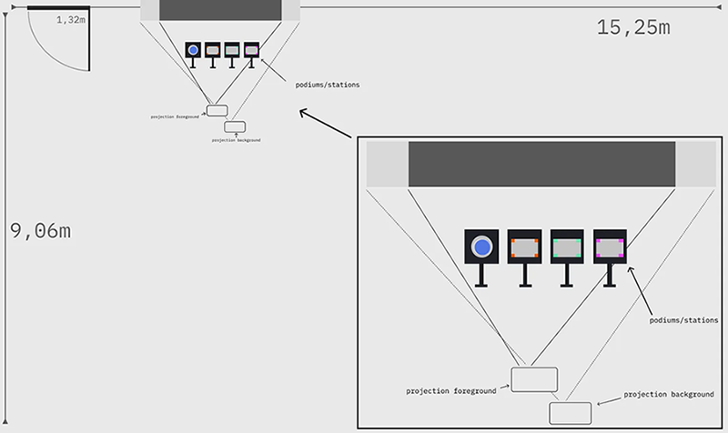
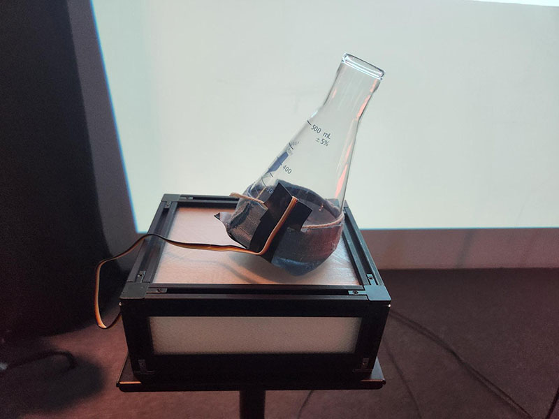
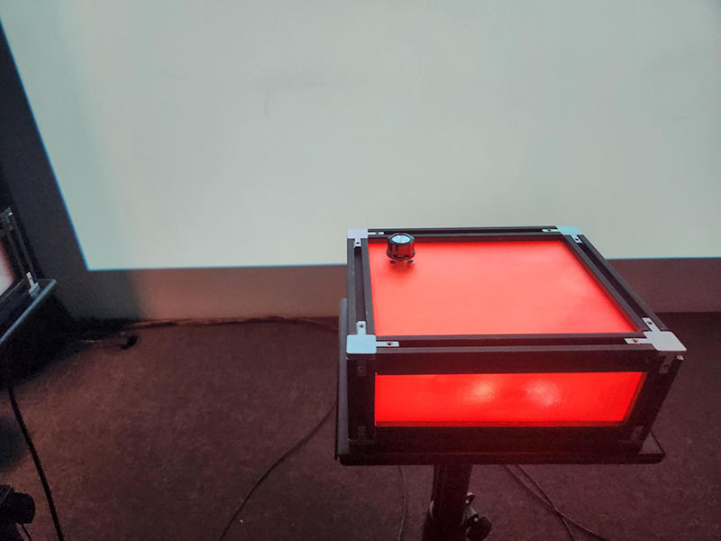
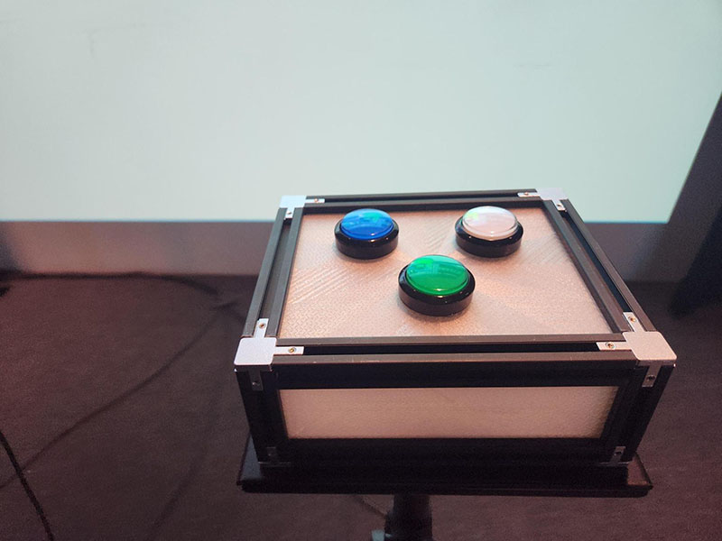
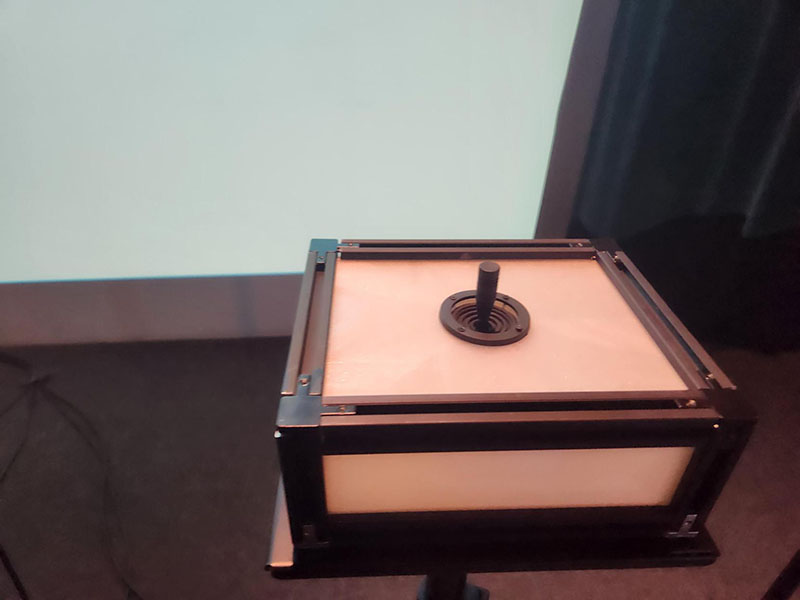

# Symbiose — Réseau vivant

## Présentation générale de l'exposition

> Panneau d'affichage de l'exposition

*Réseau Vivant* est le titre donné à l'esposition temporaire des projets de fin d'études des étudiant·es de Technique d'Intégration Multimédia au Collège Montmorency. L'exposiion s'est tenue au Grand Studio du collège du 16 au 21 mars 2026.

> Moi, Thomas Bozelko et Anne-Julie Labrie devant la première version de l'Affiche d'exposition lors de notre première visite.

J'ai visité cette exposition à deux reprises : la première fois le 24 février 2026, alors que les projets étaient encore des prototypes, et le 17 mars 2026, lors de l'exposition finale.

## Symbiose : le dispositif en détail

> Vue d'ensemble du dispositif

*Symbiose* est le nom donné au projet de Yannick Chamberland, Benjamin Ferland, Ryan Dufault et Walid Cheour. Cette installation interactive consiste en un jeu coopératif prévu pour quatre joueur·euses. Le principe du jeu est de créer une potion à l'aide d'objets interactifs disposés devant les joueur·euses.

> Cartel d'explication

## Fonction et disposition

Le dispositif se présente par quatre socles sur lesquels se trouvent des objets avec lesquels les visiteur·euses peuvent intéragir pour avancer dans le jeu. Ces objets sont reliés à un ordinateur dont l'écran est diffusé per un projecteur sur le mur face aux joueur·euses.

> Mise en espace

> Les objets utilisables par les joueur·euses.

## Mon avis

C'est clairement l'installation sur laquelle j'ai pris le plus de plaisir de toute l'exposition. J'y ai joué avec des amis, et je trouve vraiment le concept du gens intéressant et stimulant. Nous avons d'ailleurs battu le record des étudiants qui l'avaietn mis au point !

La différence entre le prototype et le produit final est également importante. Bien que déjà intéressant, le prototype avait quelques errueurs aui renqaient le jeu plus frustrant, d'une certaine manière, mais elles ont été corrigées dans la verison finale.
