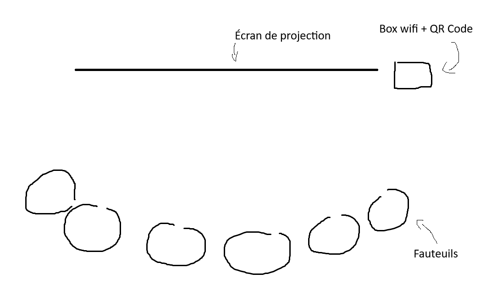

# Terminal

## Créateur·ices

Émeryk Bélisle, Elie Daher, Ting Yung Lu Terry, Dana Saavedra-Torrano, Mégane Ranger

## Installation

## Shéma de l'installation

> Croquis de la disposiotion

## Ressenti

Il y a eu une grosse évolution entre le prototype que j'ai testé quelques semaines avant l'expostition et la version finale, et j'ai largement préféré la seconde expérience. En tant qu'amatrice de jeux vidéo de manière générale, j'étais ravie de voir ce projet figurer et de pouvoir l'essayer. Malgré sa simplicité apparante, le jeu est amusant. L'aspect collaboratif est efficace et demande un vraqi travail d'équipe. De plus, le jeu est accessible à tout le monde, autant des gens aui jouent tous les jours que des gens qui ne jouent jamais.

# Arbre en Face 

## Créateur·ices

Alexandre Gendron, Mikael Arseneau, Mathieu Willett, Matis Ghariani, Rafael Angon Dubé

## Installation

## Shéma de l'installation

> Croquis de la disposition

## Ressenti

# Oignon

## Créateur·ices

Ahmed Kaissoumi, Radhouane Kordan, Justin Montpetit, Thearylou Lach, Jad Saloumi

## Installation

## Shéma de l'installation

## Ressenti

# Océan rouge

## Créateur·ices

Amira Tounekti, Kristy Moussally

## Installation

## Shéma de l'installation

## Ressenti

# Quand les Yeux se Croisent

## Créateur·ices

Edelwyn Ledru, Félix Lavoie, Jade Hébert, Manel Yaya, Patricia Nassif

## Installation

## Shéma de l'installation

## Ressenti

# Sources

Photos :

Croquis : Théana Leurot

Sites consultés : 

- https://pythons-5.github.io/Terminal/#/

- https://mammouths.github.io/projet/#/concept/

- https://o-i-g-n-o-n.github.io/Mission-decollage/#/

- https://deux-intelligence.github.io/deux-neurones/#/concept/

- https://emersiaa.github.io/Quand-les-yeux-se-croisent/#/concept/
